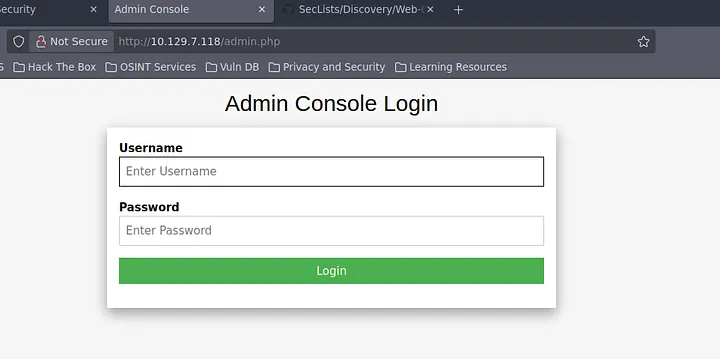
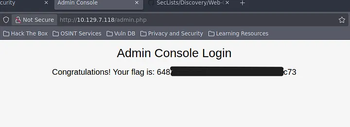

# Introduction

On continue notre ascension avec Preignition, la sixième machine du parcours Starting Point de Hack The Box (Tier 0).

>[!TIP]
Attention : Il s’agit d’une machine VIP. Vous aurez besoin d’un abonnement HTB pour pouvoir la lancer.

Cette fois-ci, on change de braquet. On s’éloigne des services réseaux “bruts” (comme **SMB** ou **RDP**) pour s’attaquer au monde du **Web**. On va apprendre à découvrir des pages cachées et à tester la plus grande faiblesse des admins pressés : les identifiants par défaut.

>[!WARNING]
>Dans ce writeup, je ne publie pas directement le flag final, l’objectif est d’apprendre en pratiquant. Si vous voulez le flag, suivez les étapes sur la machine.

>[!CAUTION]
>**NOTE :** n’attaquez que des machines sur lesquelles vous avez l’autorisation (ex. machines HTB, ou lab perso). Respectez les règles de la plateforme.

## Vidéo Walkthrough

Si tu préfères regarder un tuto plutôt que lire, voici ma vidéo :



---

## Reconnaissance

### Découverte d’hôte

On ne change pas une équipe qui gagne, on commence par un petit ``ping`` vers l'IP pour s'assurer que la machine est prête à recevoir nos tests.
````bash
┌─[user@parrot]─[~]
└──╼ $ping 10.129.7.118

PING 10.129.7.118 (10.129.7.118) 56(84) bytes of data.
64 bytes from 10.129.7.118: icmp_seq=3 ttl=63 time=13.4 ms
64 bytes from 10.129.7.118: icmp_seq=4 ttl=63 time=14.8 ms
^C
--- 10.129.7.118 ping statistics ---
6 packets transmitted, 6 received, 0% packet loss
````
La machine répond parfaitement. Elle est vivante, passons au scan de ports !

### Énumération des services

On lance notre fidèle ``nmap`` pour voir quels ports sont ouverts.
````bash
┌─[✗]─[user@parrot]─[~]
└──╼ $nmap -sV 10.129.7.118

Starting Nmap 7.94SVN ( https://nmap.org ) at 2025-12-10 19:22 UTC
Nmap scan report for 10.129.7.118
Host is up (0.030s latency).
Not shown: 999 closed tcp ports (conn-refused)
PORT   STATE SERVICE VERSION
80/tcp open  http    nginx 1.14.2
````
Un seul port ouvert, le **80**. C’est le port standard pour le trafic **HTTP**. Le service qui tourne est un serveur web **nginx** en version **1.14.2**.

Le premier réflexe quand on voit du **HTTP** ouvert, on ouvre un navigateur et on tape l’adresse **IP** de la cible. On tombe sur une page “Welcome to nginx”. C’est une page par défaut, ce qui signifie que le site est là, mais qu’il ne nous montre rien d’intéressant en surface.


---

## Pré-Exploitation

### Énumération de répertoires

Puisque la page d’accueil est vide, on va chercher des dossiers ou des fichiers “cachés” (ceux qui ne sont pas liés par des boutons ou des menus). Pour ça, on utilise ``Gobuster``.

Cet outil va tester une liste de noms de dossiers communs (une **“wordlist”**) et nous dire lesquels existent sur le serveur.
- ``dir`` : indique à ``Gobuster`` qu’il doit effectuer une énumération de fichiers et de répertoires sur un serveur web. (ajouter chaque mot de la liste a la fin de l’url, exemple : http://10.129.7.118/mot)
- ``-w`` : Sert a spécifier la liste de noms de dossier a utiliser pour le test
- ``-u`` : Sert a specifier l’ip cible a tester

````bash
┌─[✗]─[user@parrot]─[~]
└──╼ $sudo gobuster dir -w /usr/share/wordlists/common.txt -u 10.129.7.118

===============================================================
Gobuster v3.6
by OJ Reeves (@TheColonial) & Christian Mehlmauer (@firefart)
===============================================================
[+] Url:                     http://10.129.7.118
[+] Method:                  GET
[+] Threads:                 10
[+] Wordlist:                /usr/share/wordlists/common.txt
[+] Negative Status codes:   404
[+] User Agent:              gobuster/3.6
[+] Timeout:                 10s
===============================================================
Starting gobuster in directory enumeration mode
===============================================================
/admin.php            (Status: 200) [Size: 999]
Progress: 4750 / 4750 (100.00%)
===============================================================
Finished
===============================================================
````
Hop ! **Gobuster** a trouvé un fichier très suspect : **/admin.php**. Le code **Status: 200** nous confirme que la page est bien là et qu’on a le droit d’y accéder.

---

## Exploitation

### Accès initial
On se rend donc sur **http://10.129.7.118/admin.php**. On se retrouve face à un formulaire de connexion.



C’est ici que l’instinct de hacker intervient. Comme le serveur semble être une installation toute fraîche, il est fort probable que l’administrateur n’ait pas encore changé les accès. On ne sort pas les gros outils de brute-force tout de suite, on tente le “classique des classiques” :
- **Username** : **admin**
- **Password** : **admin**

On valide, et… ça fonctionne ! On est “in”.

### Récupération du flag
Une fois connecté sur l’interface d’administration, on tombe nez à nez avec notre flag.


On a enfin le sésame que l’on cherchait !

---

## Post-Exploitation

Cette machine **Preignition** nous montre deux vulnérabilités très courantes :
- **L’exposition de pages d’administration** : Ne jamais laisser une page admin accessible sans une protection supplémentaire (IP autorisée, nom de fichier complexe, etc.).
- **Les identifiants par défaut** : C’est la première chose qu’un attaquant (ou un script automatisé) va tester.

**Leçon du jour** : Toujours changer les mots de passe par défaut dès l’installation d’un service !

La machine est ***pwned*** !